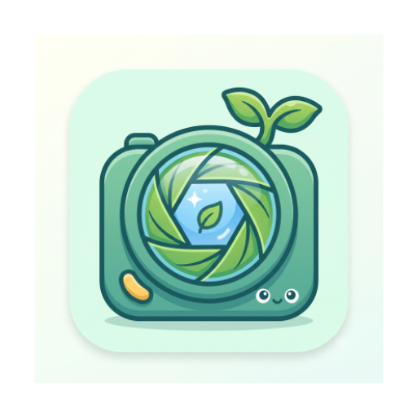
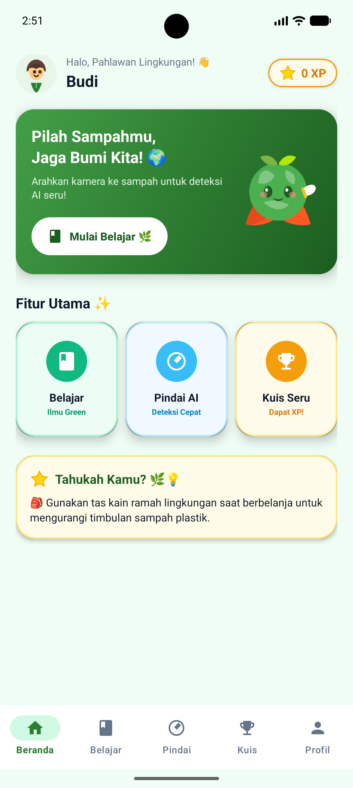
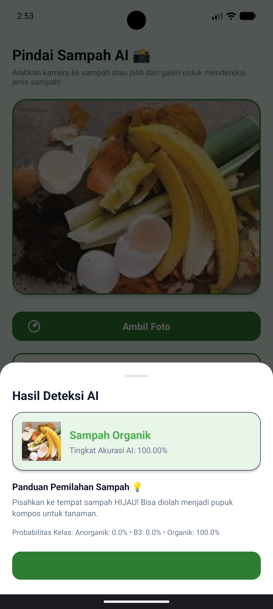
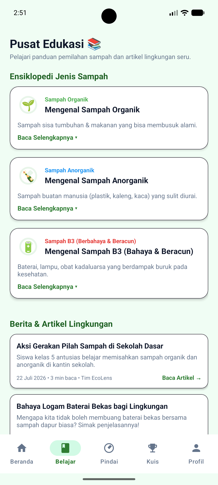
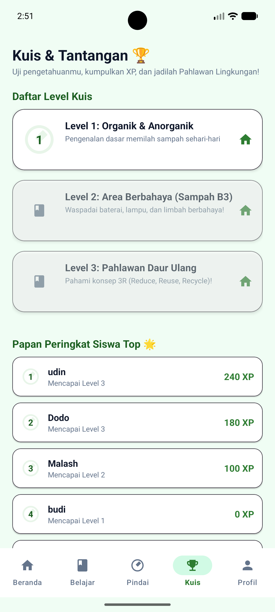
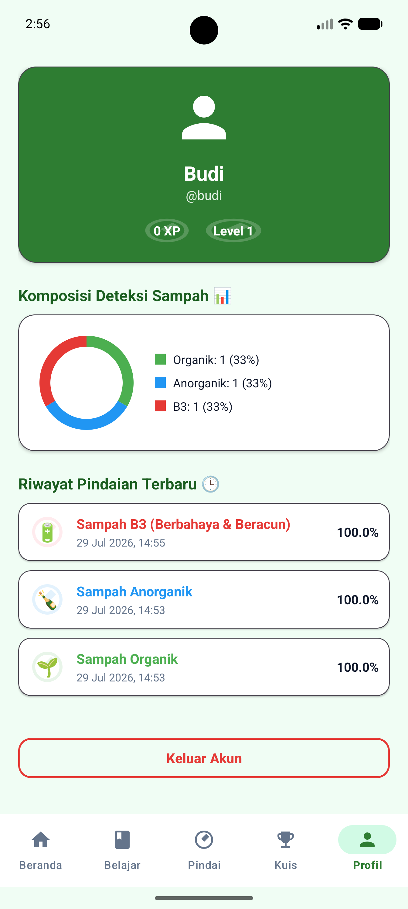

<div align="center">
  

  # EcoLens 🌿

  [](https://developer.android.com/)
  [](https://kotlinlang.org/)
  [](https://ai.google.dev/edge/litert)
  [](https://developer.android.com/training/data-storage/room)
  [](https://developer.android.com/about/dashboards)
  [](https://developer.android.com/about/versions/14)
</div>

> **EcoLens** is a smart, AI-powered Android application designed to promote environmental sustainability and proper waste sorting. Leveraging on-device machine learning with **Google AI Edge LiteRT**, EcoLens instantly classifies waste into three primary categories (**Organik**, **Anorganik**, and **B3 / Hazardous Waste**) with high accuracy — completely offline and in real-time.

---

## 📱 Screenshots & Page Overview / Tangkapan Layar & Deskripsi Halaman

Berikut adalah tampilan antarmuka (UI) dari aplikasi **EcoLens** beserta penjelasan fungsi tiap halamannya:

<div align="center">

| 🏠 Home Screen | 📷 Scan Screen | 📚 Study Screen |
| :---: | :---: | :---: |
|  |  |  |
| **Halaman Beranda** | **Pemindaian & Klasifikasi AI** | **Eco Learn Hub** |

<br/>

| 🎯 Quiz Screen | 👤 Profile Screen |
| :---: | :---: |
|  |  |
| **Eco Quiz & Gamifikasi** | **Profil & Statistik Pengguna** |

</div>

### 📑 Penjelasan Halaman (Screen Details)

1. **🏠 Home Screen (Halaman Utama / Dashboard)**
   - **Fungsi**: Pusat navigasi dan dashboard utama aplikasi.
   - **Fitur**: Menampilkan salam pembuka (*greeting*), ringkasan statistik singkat (jumlah pemindaian, total poin kuis, level pengguna), tombol akses cepat ke fitur pemindaian sampah, materi edukasi, kuis, serta daftar riwayat pemindaian sampah terbaru.

2. **📷 Scan Screen (Halaman Pemindaian & Klasifikasi AI)**
   - **Fungsi**: Pemindaian dan identifikasi jenis sampah secara *on-device* dan *real-time*.
   - **Fitur**: Mendukung pengambilan foto langsung melalui kamera atau memilih gambar dari galeri. Menggunakan model machine learning LiteRT (`waste_classifier.tflite`) untuk mendeteksi kategori sampah (**Organik**, **Anorganik**, atau **B3**), tingkat akurasi (*confidence score*), serta memberikan petunjuk penanganan sampah yang tepat.

3. **📚 Study Screen (Halaman Eco Learn Hub)**
   - **Fungsi**: Pusat edukasi dan literasi lingkungan bagi pengguna.
   - **Fitur**: Menyajikan artikel-artikel interaktif dan panduan praktis pengelolaan limbah, seperti teknik pembuatan kompos, bahaya limbah B3 bagi ekosistem, tata cara pemilahan sampah, dan tips daur ulang.

4. **🎯 Quiz Screen (Halaman Eco Quiz)**
   - **Fungsi**: Sarana evaluasi pengetahuan lingkungan secara interaktif & gamifikasi.
   - **Fitur**: Berisi soal-soal kuis seputar pemilahan sampah dan kelestarian lingkungan. Pengguna dapat memilih jawaban, memperoleh skor/poin, melihat skor akhir, dan mengulang kuis untuk meningkatkan pemahaman.

5. **👤 Profile Screen (Halaman Profil Pengguna)**
   - **Fungsi**: Pengelolaan akun dan melihat statistik aktivitas pengguna.
   - **Fitur**: Menampilkan informasi profil akun, total kontribusi lingkungan (jumlah scan & poin yang terkumpul), pengaturan akun, serta opsi untuk keluar (*logout*).

---

## 📌 Features

- 📷 **AI Waste Classification**: Capture photos or select images from gallery to classify waste into `Organik`, `Anorganik`, or `B3` in milliseconds.
- ⚡ **Offline On-Device ML**: Runs locally using `waste_classifier.tflite` (MobileNetV2), eliminating the need for an active internet connection or external API calls.
- 📜 **Scan History & Tracking**: Log classification results, confidence scores, and timestamps to track waste management habits over time.
- 📚 **Eco Learn Hub**: Interactive guides and educational content on waste recycling, composting, and hazardous waste disposal.
- 🎯 **Eco Quiz & Gamification**: Challenge environmental knowledge with quizzes, earn scores, and track progress.
- 👤 **Local Account & Session Management**: Secure user authentication and user session persistence backed by Room SQLite Database.
- 🎨 **Modern Material 3 UI**: Clean, intuitive UI built using ViewBinding, Navigation Fragments, and Material Design guidelines.

---

## 🛠️ Architecture & Tech Stack

### Architecture
EcoLens follows the recommended **MVVM (Model-View-ViewModel)** pattern with a clean **Repository Layer** for data isolation:

```
┌─────────────────────────────────────────────────────────┐
│                    UI Layer (Views)                     │
│    Activities, Fragments, ViewBinding, Navigation UI    │
└───────────────────────────┬─────────────────────────────┘
                            │
┌───────────────────────────▼─────────────────────────────┐
│                    ViewModel Layer                      │
│      ViewModels + ViewModelFactory State Management      │
└───────────────────────────┬─────────────────────────────┘
                            │
┌───────────────────────────▼─────────────────────────────┐
│                    Repository Layer                     │
│           User, ScanHistory & Quiz Repositories         │
└─────────────┬─────────────────────────────┬─────────────┘
              │                             │
┌─────────────▼─────────────┐ ┌─────────────▼─────────────┐
│  Local Data (Room DB)     │ │   ML Inference Engine     │
│  User / Scan / Quiz DAOs  │ │   TFLite / LiteRT Model   │
└───────────────────────────┘ └───────────────────────────┘
```

### Tech Stack Details
- **Programming Language**: [Kotlin](https://kotlinlang.org/)
- **Min SDK**: 24 (Android 7.0 Nougat)
- **Target SDK**: 36 (Android 14) / Compile SDK: 37
- **AI / ML Engine**: `com.google.ai.edge.litert:litert:1.0.1` (MobileNetV2 TFLite model)
- **Local Persistence**: Android Room Database & SharedPreferences
- **Navigation**: Jetpack Navigation Component (Single-Activity pattern with Fragments)
- **UI Framework**: Material Components, ViewBinding, ConstraintLayout

---

## 🧠 Machine Learning Model Details

| Attribute | Specification |
| :--- | :--- |
| **Model File** | `waste_classifier.tflite` (located in `app/src/main/assets/`) |
| **Base Architecture** | MobileNetV2 |
| **Input Shape** | `[1, 224, 224, 3]` (FLOAT32 RAW RGB pixels `[0..255]`) |
| **Output Classes** | `3` classes: `anorganik`, `b3`, `organik` |
| **Output Shape** | `[1, 3]` (FLOAT32 probability array) |
| **Preprocessing** | Automatic scaling via graph layer (`Rescaling(1/127.5, offset=-1)`) |

---

## 📂 Project Structure

```
EcoLens/
├── app/
│   ├── src/
│   │   ├── main/
│   │   │   ├── assets/
│   │   │   │   └── waste_classifier.tflite      # Quantized TFLite ML model
│   │   │   ├── java/com/adam/ecolens/
│   │   │   │   ├── MainActivity.kt               # Main Host Activity & Navigation Container
│   │   │   │   ├── Tfliteclassifier.kt           # LiteRT Classifier Wrapper
│   │   │   │   ├── data/
│   │   │   │   │   ├── local/                    # Room DB, Entities, DAOs, SessionManager
│   │   │   │   │   ├── model/                    # Data models
│   │   │   │   │   └── repository/               # Repositories
│   │   │   │   └── ui/
│   │   │   │       ├── auth/                     # Login & Register UI
│   │   │   │       ├── home/                     # Dashboard UI
│   │   │   │       ├── scan/                     # Camera & Classification UI
│   │   │   │       ├── learn/                    # Educational Articles UI
│   │   │   │       ├── quiz/                     # Quiz & Gamification UI
│   │   │   │       └── profile/                  # User Profile & Stats UI
│   │   │   └── res/                             # Layouts, Drawables, Values & Navigation graphs
├── home_screen.png                               # Screenshot: Halaman Utama / Dashboard
├── profile_screen.png                            # Screenshot: Halaman Profil Pengguna
├── quiz_screen.png                               # Screenshot: Halaman Eco Quiz
├── scan_screen.png                               # Screenshot: Halaman Pemindaian AI
├── study_screen.png                              # Screenshot: Halaman Eco Learn Hub
├── build.gradle.kts                              # Root build script
├── settings.gradle.kts                           # Module settings & dependency repositories
└── README.md                                     # Project Documentation
```

---

## 🚀 Getting Started

### Prerequisites
- **Android Studio**: Ladybug (2024.2.1) or newer
- **JDK**: Version 11 or higher
- **Gradle**: 8.x+
- **Test Device**: Android Physical Device or Emulator with API Level 24+

### Installation Steps

1. **Clone the Repository**
   ```bash
   git clone https://github.com/Adam-Nurwahid/EcoLens.git
   cd EcoLens
   ```

2. **Open in Android Studio**
   - Launch Android Studio and click **Open**.
   - Select the `EcoLens` root directory.

3. **Sync Project with Gradle Files**
   - Allow Gradle to download dependencies (including Google AI Edge LiteRT).

4. **Run the App**
   - Connect an Android device with USB debugging enabled or launch an emulator.
   - Click **Run `app`** (`Shift + F10`) in Android Studio.

---

## 🤝 Contributing

Contributions, issues, and feature requests are welcome! Feel free to check the [issues page](https://github.com/Adam-Nurwahid/EcoLens/issues).

---

## 👤 Author

- **Adam Nurwahid** - [Adam-Nurwahid](https://github.com/Adam-Nurwahid)

---

## 📄 License

This project is licensed under the MIT License - see the [LICENSE](LICENSE) file for details.
